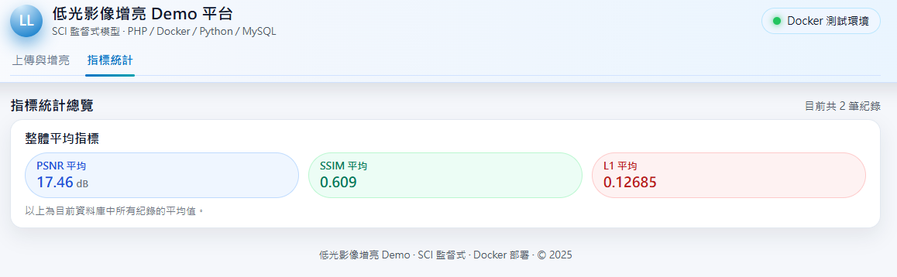

<h1 align="center">🚀 Low-Light Image Enhancement Web System</h1>
<p align="center">
  <b>PHP + Python (PyTorch) + MySQL + GCP VM</b>
</p>

<p align="center">
  
  
  
  
  
</p>

---

## 🔗 Demo  (尚未上線)

👉 http://<your-vm-ip>/lowlight_demo

---

## 📌 Overview  
本系統用於測試與驗證自己訓練的權重，透過權重進行推論，能檢視在不同低光影像的增亮效果。<br>
提供 **低光影像增亮（Low-Light Enhancement）** 的全端 Web 系統，整合：
- PHP（前端與 API）
- Dockerized Python + PyTorch（SCI 模型推論 + 指標計算）
- MySQL（儲存影像紀錄與 PSNR / SSIM / L1 指標）
- GCP VM（雲端部署）

➤ 使用者上傳低光影像後，系統會透過模型自動進行增亮，並計算對應的 PSNR、SSIM 與 L1 指標。<br>
➤ 結果會連同影像紀錄一併寫入資料庫，並在頁面下方的增亮紀錄區塊中呈現。<br>
➤ 由於此系統在GCP VM是用CPU跑深度學習權重進行增亮，因此系統推論會較慢。

---
## 🖼 UI Preview

### 上傳與增亮頁面


### 指標統計頁面

---

## ✨ Features

### ⭐ Web-based Enhancement  
- 上傳圖片 → Docker 模型增亮 → 顯示增亮影像
- 支援前後對比 Slider、圖片放大預覽、影像下載

### ⭐ Deep Learning Inside Docker
- SCI 增亮模型與所有 Python 套件皆封裝於 Docker 
- 不必自己設環境

### ⭐ Image Metrics (PSNR / SSIM / L1)
- 增亮後自動計算 3 種影像品質指標
- 影像指標支援匯出 CSV 功能

### ⭐ Records & Pagination
- 每頁顯示 6 筆增亮紀錄
- 顯示 PSNR、SSIM 與 L1 指標
- 支援刪除、下載、放大預覽、前後對比

### ⭐ MySQL Logging  
- 紀錄每次上傳與輸出結果  
---

## 📁 專案架構

```text
lowlight_demo/
│
├── uploads/            # 使用者上傳圖片
├── outputs/            # 模型輸出圖片
├── weights/            # 模型權重 
├── db/                 # 資料庫設置檔案
│   └──schema.sql  
│
├── python_api/
│   ├── enhance_cli.py  # 增亮 CLI 主程式
│   ├── metrics_cli.py  # 計算 PSNR / SSIM / L1 的 CLI
│   ├── model.py        # 模型架構
│   └── loss.py         # 計算損失
│ 
├── view/
│   ├── layout_footer.php  # 共用 Header 
│   └── layout_header      # 共用 Footer 
│ 
├── index.php           # 主頁:上傳、增亮紀錄
├── upload.php          # 上傳 → 呼叫 Docker 增亮 + 指標 → 寫入 DB
├── config.php          # MySQL 連線設定
├── delete.php          # 刪除單筆紀錄與對應檔案
├── metrics.php         # 指標統計頁
├── export_csv.php      # 匯出所有紀錄為 CSV
│
├── Dockerfile          # 建立 Docker image     
├── requirements.txt    # python環境所需套件
├── README.md         
└── .gitignore
```
---
## ⚙️ 運作流程

```text
[Browser]
    │ 上傳影像
    ▼
[PHP: upload.php]
    │ 儲存檔案至 /uploads
    │ 呼叫 Docker container → enhance_cli.py
    ▼
[Python Model]
    │ 增亮影像
    │ 儲存輸出至 /outputs
    ▼
[PHP Backend]
    │ 呼叫 Docker → metrics_cli.py 計算 PSNR/SSIM/L1
    │ 存入MySQL資料庫
    ▼
[Web UI]
    顯示增亮影像 + 指標 + 功能按鈕（放大/對比/刪除/下載）
```
---
## 🗄 資料庫設置 (MySQL)

### 1. 建立資料庫
```sql
CREATE DATABASE lowlight_demo_db;
```
### 2️. 匯入資料表 schema
```
mysql -u root -p lowlight_demo_db < db/schema.sql
```
---
## 📑 images 資料表結構說明

| 欄位名稱        | 說明                                   |
|-----------------|----------------------------------------|
| `id`            | 主鍵（AUTO_INCREMENT）                 |
| `orig_name`     | 上傳的原始影像檔名                     |
| `stored_name`   | 影像增亮後的檔名                 |
| `created_at`    | 上傳與影像增亮完成的時間                    |
| `psnr`          | Peak Signal-to-Noise Ratio（越高越好） |
| `ssim`          | Structural Similarity（越接近 1 越好） |
| `l1`            | L1 差異值（越低越好）                   |
---
## 🚀 Running the System

### 1. 安裝 Docker

### 2. 建置推論 Image：
```
docker build -t lowlight-python .
```
### 3. 建立 MySQL 資料庫並匯入db/schema.sql

### 4. 啟動 Apache（XAMPP / GCP VM）

### 5. 瀏覽器開啟：
```
http://localhost/lowlight_demo/
```
---
## 📝 Future Improvements
- 功能/UI介面 優化
- 支援批次影像增亮
