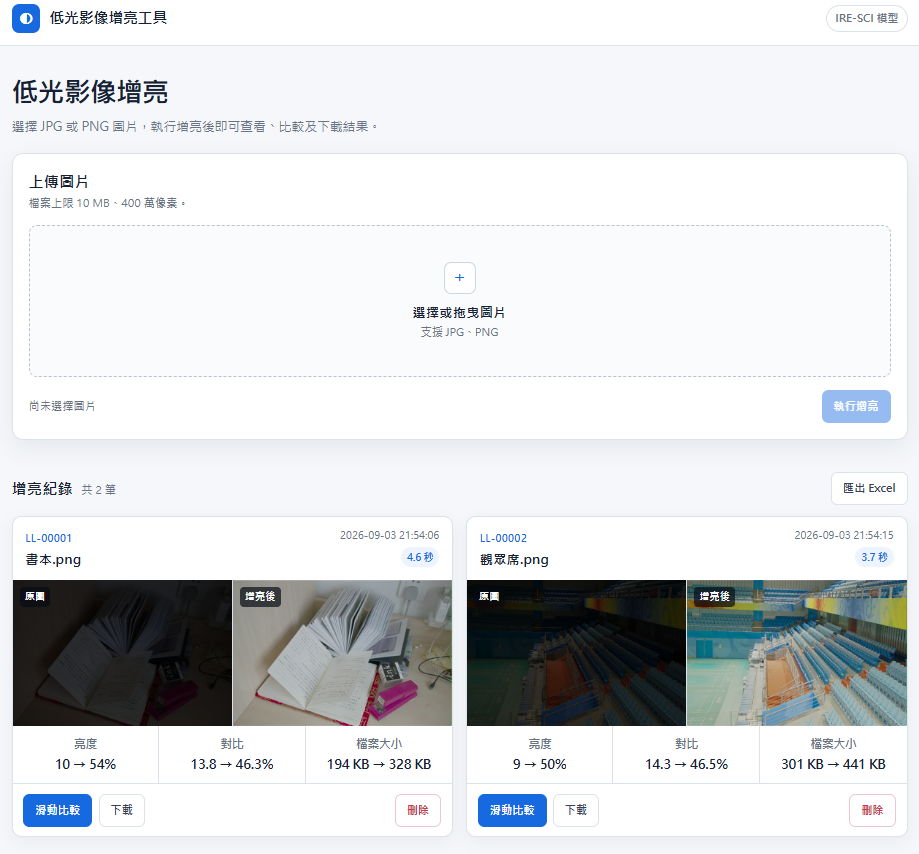

<h1 align="center">🚀 Low-Light Image Enhancement Web Tool</h1>

<p align="center">
  <b>PHP + Python (PyTorch) + MySQL + Docker</b>
</p>

<p align="center">
  
  
  
  
  
</p>

---

## 🖼 UI Preview



---

## 📌 Overview

本專案是一套低光影像增亮 Web 工具，用於測試自行訓練的 IRE-SCI 低光影像增亮模型。

使用者可以透過網頁上傳低光圖片，系統會呼叫 Docker 中的 Python 與 PyTorch 模型執行推論，並將原圖、增亮結果及影像資訊記錄至 MySQL。

系統採用 MVC 架構，主要技術包括：

- PHP：Web 介面、路由、圖片驗證及流程控制
- Python：影像處理、模型推論及影像分析
- PyTorch：IRE-SCI 低光影像增亮模型
- Docker：建立獨立的 Python 推論環境
- MySQL：儲存影像與處理紀錄

---

## ✨ Features

### ⭐ 低光影像增亮

- 支援 JPG、PNG 圖片
- 單張圖片最大 10 MB、400 萬像素
- 上傳後自動執行模型增亮

### ⭐ 增亮結果與比較

- 顯示原圖與增亮結果
- 支援滑動比較與放大預覽
- 支援增亮圖片下載
- 顯示亮度、對比、解析度、檔案大小及處理時間

### ⭐ 紀錄管理

- 每頁顯示 6 筆增亮紀錄
- 刪除紀錄時同步刪除原圖與增亮圖片
- 支援 Excel `.xlsx` 匯出

---

## 🧠 Model & Image Analysis

模型推論使用自行訓練的 IRE-SCI 權重：

```text
python_api/weights/best.pt
```

- 平均亮度：使用 Rec.709 加權亮度計算
- 對比範圍：亮度第 95 百分位減去第 5 百分位
- 圖片解析度：圖片寬度與高度
- 檔案大小：比較原圖與增亮圖片的 KB 大小
- 處理時間：記錄完整 Docker 推論流程所需時間

---

## ⚙️ System Workflow

```text
[Browser]
    │
    │ 上傳 JPG / PNG 圖片
    ▼
[PHP Router / ImageController]
    │
    │ 驗證圖片格式、大小及尺寸
    ▼
[EnhancePipeline]
    │
    │ 儲存原圖至 public/uploads
    │ 啟動 Docker Container
    ▼
[Python / PyTorch]
    │
    │ 載入 IRE-SCI 模型權重
    │ 執行低光影像增亮
    │ 計算影像資訊
    │ 儲存結果至 public/outputs
    ▼
[PHP Backend / MySQL]
    │
    │ 寫入圖片與處理紀錄
    ▼
[Web UI]
    ├── 顯示原圖與增亮結果
    ├── 滑動比較
    ├── 放大預覽
    ├── 圖片下載
    ├── 紀錄刪除
    └── Excel 匯出
```

---

## 📁 Project Structure

```text
lowlight_demo/
│
├── index.php                         # 將請求導向 public/
│
├── app/
│   ├── config/
│   │   ├── bootstrap.php             # 系統初始化與物件組裝
│   │   └── database.php              # PDO 資料庫連線
│   │
│   ├── controllers/
│   │   └── ImageController.php       # 上傳、刪除、分頁及匯出控制
│   │
│   ├── helpers/
│   │   └── view.php                  # View、跳轉、CSRF 與訊息函式
│   │
│   ├── models/
│   │   └── ImageModel.php            # images 資料表操作
│   │
│   ├── services/
│   │   ├── DockerCli.php             # Docker 指令與逾時控制
│   │   ├── EnhancePipeline.php       # 上傳、增亮及資料寫入流程
│   │   └── SpreadsheetExporter.php   # Excel XLSX 匯出
│   │
│   └── views/
│       ├── layouts/
│       │   ├── header.php            # HTML 頁首與導覽列
│       │   └── footer.php            # 頁尾、Modal 與 JavaScript
│       │
│       ├── pages/
│       │   └── index.view.php        # 上傳與增亮紀錄頁面
│       │
│       └── partials/
│           └── record_cards.php      # 增亮紀錄卡片
│
├── public/
│   ├── index.php                     # Front Controller 與 Router
│   ├── .htaccess                     # Apache 設定
│   ├── assets/
│   │   ├── app.css                   # UI 樣式
│   │   └── app.js                    # 上傳預覽、Modal 與比較 Slider
│   ├── uploads/                      # 使用者上傳的原始圖片
│   └── outputs/                      # 模型增亮後的圖片
│
├── python_api/
│   ├── enhance_cli.py                # 模型推論 CLI
│   ├── image_analysis.py             # 影像資訊計算
│   ├── model.py                      # IRE-SCI 模型架構
│   ├── loss.py                       # 模型訓練損失函式
│   └── weights/
│       └── best.pt                   # 訓練完成的模型權重
│
├── db/
│   └── schema.sql                    # 資料庫與 images 資料表結構
│
├── docker/
│   ├── Dockerfile                    # Python 推論環境
│   └── requirements.txt              # Python 套件
│
├── docs/
│   └── ui_overview.png               # Web 工具介面截圖
│
├── .gitignore
└── README.md
```

---

## 🛠 Technical Design

- 使用 MVC 分離資料庫、流程控制與畫面邏輯
- 使用 Docker 隔離 PyTorch 推論環境
- 使用 MIME Type 驗證實際圖片格式
- 使用 CSRF Token 保護上傳與刪除請求
- 使用規律化檔名避免使用者檔名衝突
- 資料庫欄位直接標示 `%`、`px`、`KB`、`ms` 單位
- Excel 匯出自動設定欄寬、篩選及固定標題列

---

## 📝 Future Improvements

- 支援批次圖片增亮
- 增加 GPU 推論支援
- 增加背景工作佇列
- 增加自動化測試
- 增加圖片搜尋與篩選
